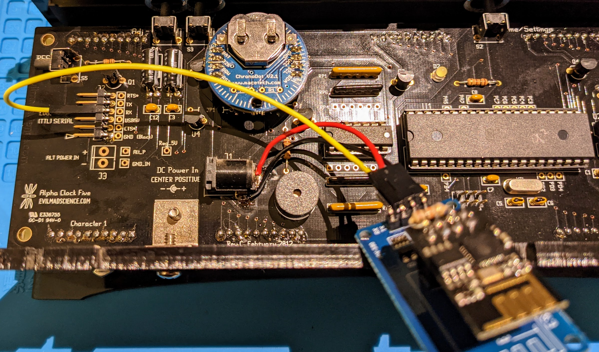
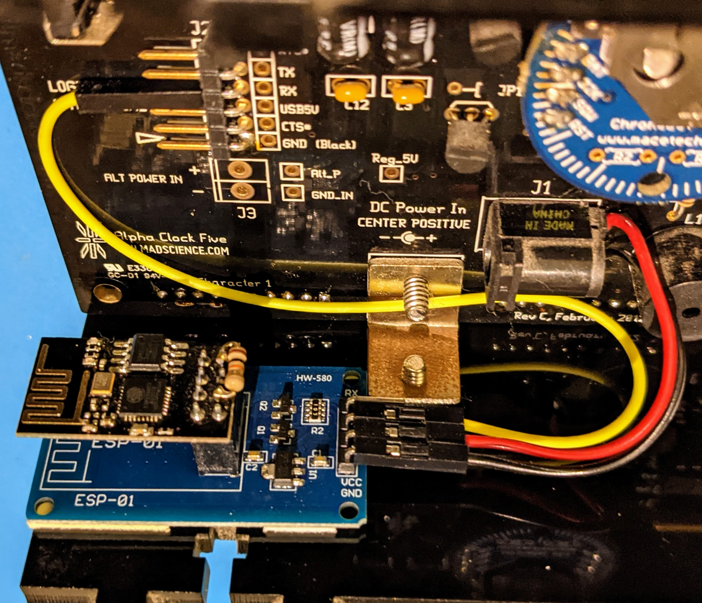

# Alpha Clock Five NTP Client

When installed on an ESP8266, this firmware will attach to a configured WiFi network, request the current time via NTP, and send updates to the Alpha Clock Five through its serial update protocol keeping the clock's time as accurate as possible.

After the first boot, the AC5 will display **"SETUP"** and the NTP client device will present an access point called **"AC5_NTP_SETUP"**. Using a mobile device, attach to that AP, and you will be taken to the WiFi configuration page. Select your WiFi network and configure the password. If successful, the clock will display **"WIFI"** then **"CONN"** signifying the connection was complete. Within 60 seconds, your clock should be updated with the current NTP time for your configured timezone.

## Timezone Config

In the `src/main.cpp`, modify the `TimeChangeRule` and `Timezone` lines at the beginning of the file to suit your needs. A link to more detailed documentation on the Timezone library is provided in the source.

## Hardware

This firmware will likely work with other ESP8266 modules, but I have only tested with the items below. If you have experimented with other modules, please let me know, and I will update the platformio.ini accordingly.

- 1 x [ESP-01 ESP8266 module](https://amazon.com/dp/B010N1ROQS)
- 1 x [ESP-01 Serial Adapter](https://amazon.com/dp/B0BPSJ82F2)
- 3 x [Dupont-style female-to-female wires](https://amazon.com/dp/B081N3G8NT)

## Physical Install

1. Solder the serial adapter PCB's power leads either to the DC barrel jack or the **"ALT POWER IN"** points on the AC5 PCB. The TX pin of the adapter PCB should attach to the RX pin of the AC5 serial header.

   _**NOTE:**_ The voltage regulator on the serial adapter PCB should be able to handel the input voltage from the AC5's power supply, but please verify your hardware before applying power.

1. Using double-sided tape, secure the serial adapter PCB to the bottom panel of the case.

